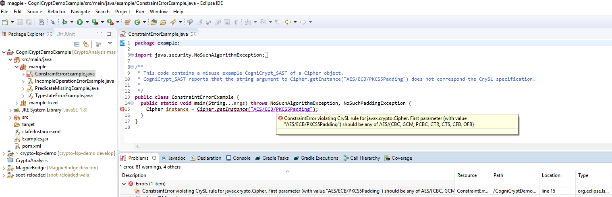
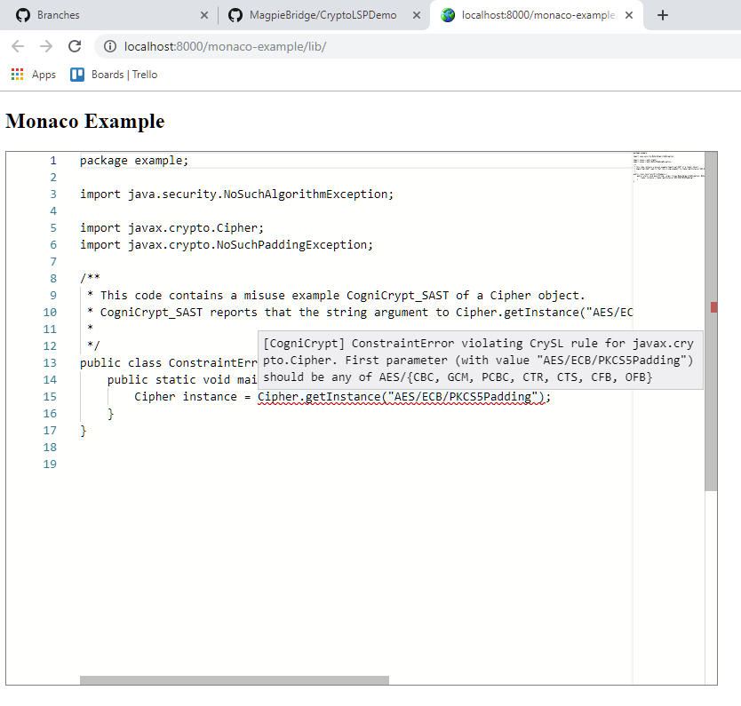
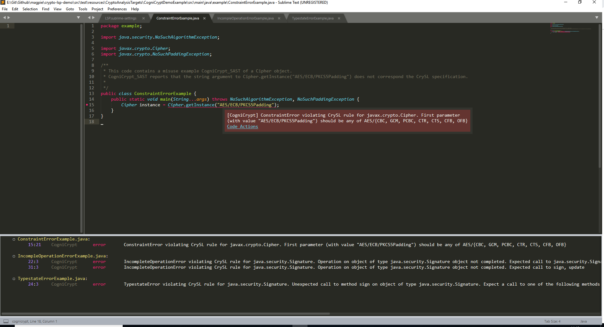
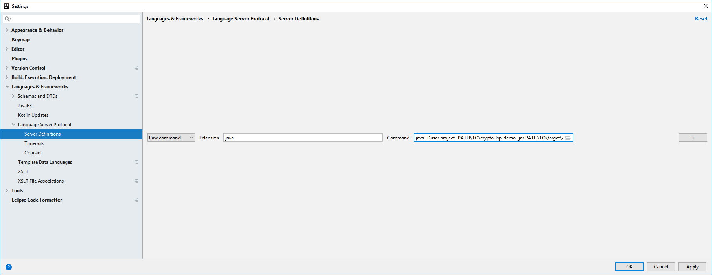
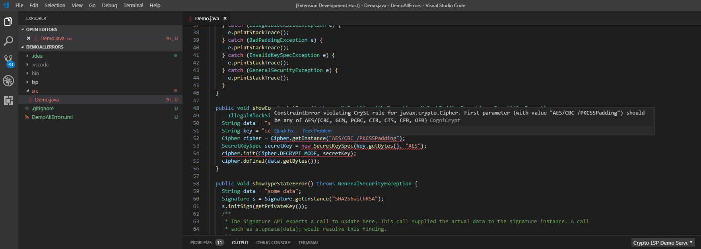
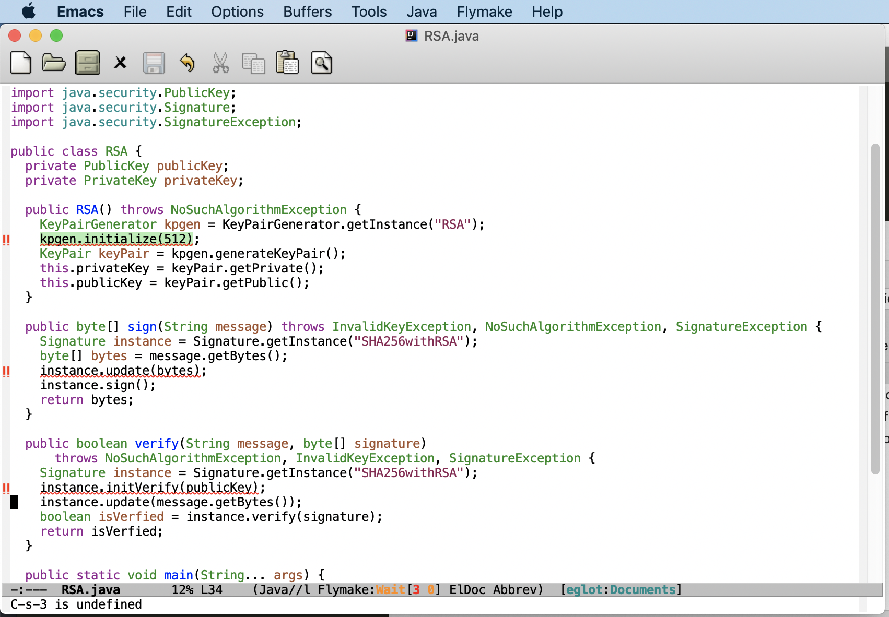

# CryptoLSPDemo[](https://travis-ci.com/MagpieBridge/CryptoLSPDemo)
This project demonstrates integrating CogniCrypt into different IDEs with [MagpieBridge](https://github.com/MagpieBridge/MagpieBridge).


## Tested IDEs/Editors
- Eclipse
- IntelliJ
- AndroidStudio
- VS Code 
- Sublime Text
- Emacs
- Microsoft Monaco 


**You can skip step 1 and 2 to get the jars from the mvn branch https://github.com/MagpieBridge/CryptoLSPDemo/tree/mvn/repository**
1. check out "websockets" branch from lsp4j https://github.com/MagpieBridge/lsp4j.git 
- run ``gradlew build -x test``
- run ``gradlew install -Dmaven.repo.local="path\to\your\local\m2\repository"``
2. install CryptoAnalysis.
- check out "master" branch from CryptoAnalysis https://github.com/MagpieBridge/CryptoAnalysis.git
- install with  ``mvn install -DskipTests`` 
3. check out "master" branch from MagpieBridge https://github.com/MagpieBridge/MagpieBridge.git
- install with ``mvn install -DskipTests`` 
4. check out "master" branch from CryptoLSPDemo https://github.com/MagpieBridge/CryptoLSPDemo.git
- install with ``mvn install -DskipTests`` 
5. Configure ``crypto-lsp-demo-0.0.1-SNAPSHOT.jar`` als language server in IDEs/editors (Eclipse, IntellIJ)

## Run Eclipse demo
- install lsp4e - http://download.eclipse.org/lsp4e/releases/latest/ 
- create new launch configuratio called crytoLSP: 


- set up in Main ->Location ``PATH\TO\Java8JDK\bin\java.exe``
- set up in Main ->Arguments for java: 
``-jar PATH\TO\crypto-lsp-demo\target\crypto-lsp-demo-0.0.1-SNAPSHOT.jar -c PATH\TO\crypto-lsp-demo``


- open Eclipse->Window->Preferences->Language Servers


- click add -> Text -> Java Source File -> Program -> crytoLSP ->OK


**Insecure crypto warning in Eclipse**


## Run monaco demo
- install the JavaScript package manager npm, ``cd monaco-example`` and ``npm install`` to build the example  
- build crypto server war file with ``mvn war:war``
- copy ``crypto-lsp-demo-0.0.1-SNAPSHOT.war`` to ``tomcat\webapps`` and change the name to ``crypto-lsp-demo.war`` 
- configure JVM option for tomcat: for windows, add this line ``set JAVA_OPTS="-Duser.project=PATH\TO\crypto-lsp-demo"`` to ``tomcat\bin\catalina.bat``.
for linux, add ``JAVA_OPTS="-Duser.project=PATH\TO\crypto-lsp-demo"`` to ``tomcat\bin\catalina.sh``(tested for tomcat-9.0.13)
- start ``tomcat\bin\startup.bat`` or ``tomcat\bin\startup.sh``
- copy ``monaco-example`` to ``minweb\htdocs`` of [minweb](https://sourceforge.net/projects/miniweb/) and start minweb.exe
- open http://localhost:8000/monaco-example/lib/ in browser

**Insecure crypto warning in Monaco web editor**


## Run Sublime demo
- install ``Package Control`` in ``Command Palette`` (windows)
- select and intall package LSP in Package Control (windows)
- paste the following configuration into ``Preferences/Package Settings/LSP/Setting`` 
	
```
{
  "log_debug": true,

  "clients": {
    "cognicrypt": {
    "command": ["C:\\PROGRA~1\\Java\\JDK18~1.0_1\\bin\\java","-jar", "PATH\\TO\\crypto-lsp-demo\\target\\crypto-lsp-demo-0.0.1-SNAPSHOT.jar","-c", "PATH\TO\crypto-lsp-demo"], 
    "enabled": true,
    "languageId": "java",
    "scopes": ["source.java"],
    "syntaxes": ["Packages/Java/Java.sublime-syntax"], 
    }
  }
}
	
```

- select ``Setup Language Server`` in ``Command Palette`` and enable ``Globally``
- restart Sublime and open an example 

**Insecure crypto warning in Sublime Text**


## Run IntelliJ demo
- install Plugin "LSP Support":(Settings > Plugins > Search for "LSP Support" 
- add Server definition: Settings > Language & Frameworks > Language Server Protocol > Server Definitions
	- Raw command -> Extension: java -> Command: 
	``java -jar PATH\TO\crypto-lsp-demo\target\crypto-lsp-demo-0.0.1-SNAPSHOT.jar -c PATH\TO\crypto-lsp-demo``
	



- add LSP server to inspections: (Analyze > Inspect Code > Inspection profile ... > LSP )

- click OK, crypto warnings will be shown in the View "Inspection Results".

## Run VSCode demo

Language servers in VSCode can only be configured by writing a small vscode extension using the 'vscode-languageclient' library. 
This demo contains all necessary configurations and the implementation of the vscode extension.
The extension is written in TypeScript and is comprised of three important files: 
1. ``vscode/src/extension.ts``: lsp-client implementation
- configures the jar and commandline arguments for the lsp server

```
let script = 'java';
    let args = ['-jar',context.asAbsolutePath(path.join('crypto-lsp-demo.jar')),"-c", context.asAbsolutePath('.')];
    let serverOptions: ServerOptions = {
        run : { command: script, args: args },
        debug: { command: script, args: args} //, options: { env: createDebugEnv() }
    };
 ```
    
- configures the language and a watcher to be notified when .java files change

```
let clientOptions: LanguageClientOptions = {
        documentSelector: [{ scheme: 'file', language: 'java' }],
        synchronize: {
            configurationSection: 'java',
            fileEvents: [ workspace.createFileSystemWatcher('**/*.java') ]
        }
    };
```
- start the language client:

```
let lc : LanguageClient = new LanguageClient('crypto-lsp-demo','Crypto LSP Demo Server', serverOptions, clientOptions);
lc.start();
```    
    
2. ``vscode/package.json``: manifest file for the extension

- contains the path to the lsp client code: 
	- ``"main": ".out/extension"``
- configures the file type to start the language server
	- ``"activationEvents": [
		"onLanguage:java"
	]``
- configures the dependencies for the extension:
	- ``"dependencies": {
			"vscode-languageclient": "^5.2.1"
		}``
- copies the jar and configuration files into the extension folder:
	- ``"scripts": {
		"vscode:prepublish": "cp [...]",
		[..]
		}``
3. ``tsconfig.json``: Compiler configuration for TypeScript

To execute the demo in vscode:
		
1. Make sure npm is installed
2. compile and install VsCode extension from terminal:
	- ``cd PATH\\TO\\crypto-lsp-demo\vscode``
	- ``npm install``
	- ``npm install -g vsce``
	- ``vsce package``
	- ``code --install-extension crypto-lsp-demo-0.0.1.vsix``
	- restart VSCode
	
**Insecure crypto warning in VSCode**


## Run Emacs Demo
1. copy the following lines
```
;; load emacs 24's package system. Add MELPA repository.
(when (>= emacs-major-version 24)
  (require 'package)
  (add-to-list
   'package-archives
   ;; '("melpa" . "http://stable.melpa.org/packages/") ; many packages won't show if using stable
   '("melpa" . "http://melpa.milkbox.net/packages/")
   t))
(package-initialize)
(package-install 'eglot)
(require 'eglot)
(add-hook 'java-mode-hook 'eglot-ensure) 
(add-to-list 'eglot-server-programs '(java-mode . ("PATH_TO_JAVA_HOME/bin/java" "-jar" "PATH_TO/CogniCryptLSP-0.0.1.jar" "-c" "PATH_TO/config")))
```

**Insecure crypto warning in Emacs**


## Extensions of this demo 
[Path Conditions to Enhance Comprehension of Cryptographic Misuses](https://github.com/SvenEV/CryptoLSPDemo/tree/pathconditions) by Sven Erik Vinkemeier

## Contact 
&#x2709; linghui[at]outlook.de
