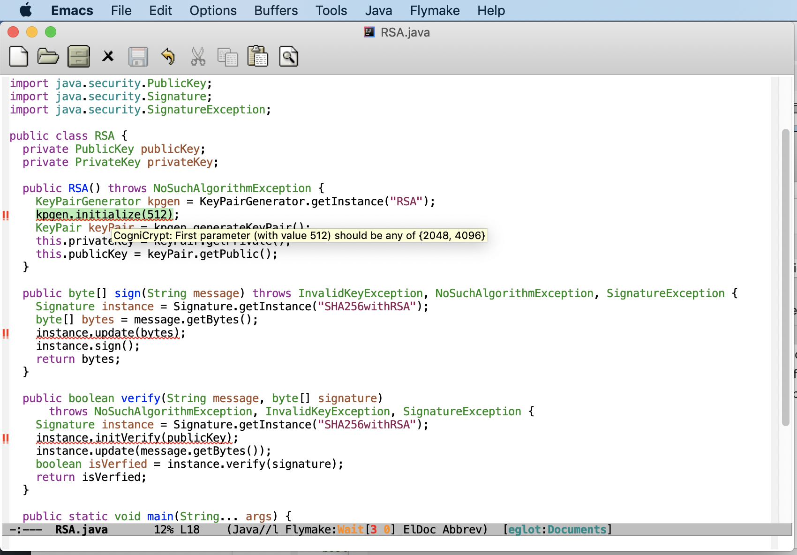

# How to run CogniCryptLSP in Emacs?
1. Make sure you have installed [Emacs](https://www.gnu.org/software/emacs/download.html). Tested version for this tutorial is GNU Emacs 26.3.

2. Download `CogniCryptLSP-0.0.1.jar` and `config.zip` from https://github.com/MagpieBridge/CryptoLSPDemo/releases, unzip `config.zip`.

3. Edit [Emacs initialization file](https://www.gnu.org/software/emacs/manual/html_node/emacs/Init-File.html) --- `.emacs` by adding the following lines. Change the paths used in the last two lines to your local paths. 

The following lines (1)install the Emacs [eglot](https://github.com/joaotavora/eglot) LSP Client support from [MELPA](https://melpa.org/#/eglot) with Emacs the built-in package manager (You can install with the command `M-x package-install`<kbd>ENTER</kbd> `eglot` <kbd>ENTER</kbd> alternatively). (2)launch the CogniCryptLSP with Java 1.8, so make sure you have Java 1.8 installed.

```
;; load emacs 24's package system. Add MELPA repository.
(when (>= emacs-major-version 24)
  (require 'package)
  (add-to-list
   'package-archives
   ;; '("melpa" . "http://stable.melpa.org/packages/") ; many packages won't show if using stable
   '("melpa" . "http://melpa.milkbox.net/packages/")
   t))
(package-initialize)
(package-install 'eglot)
(require 'eglot)
(add-hook 'java-mode-hook 'eglot-ensure) 
(add-to-list 'eglot-server-programs '(java-mode . ("PATH_TO_JAVA_HOME/bin/java" "-jar" "PATH_TO/CogniCryptLSP-0.0.1.jar" "-c" "PATH_TO/config")))

```
An example for `.emacs` file can be downloaded from [here](https://github.com/MagpieBridge/CryptoLSPDemo/blob/master/doc/.emacs)

4. Open a Java File in Emacs will trigger CogniCryptLSP to run. You can use [RSA.java](https://github.com/MagpieBridge/CryptoLSPDemo/blob/master/doc/RSA.java) to test.



5. To rerun CogniCryptLSP in a changed Java File, simply save the file.


Questions? Ask [Linghui Luo](https://github.com/linghuiluo)
