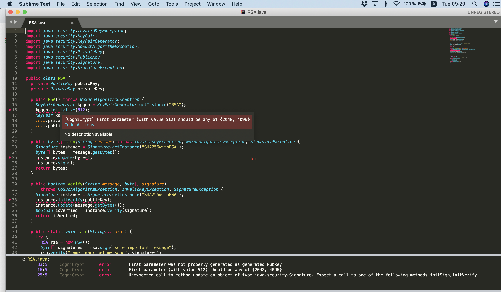

# How to run CogniCryptLSP in Sublime Text?
1. Make sure you have installed [Sublime Text](). Tested version for this tutorial is Sublime Text 3.2.1.

2. Download `CogniCryptLSP-0.0.1.jar` and `config.zip` from https://github.com/MagpieBridge/CryptoLSPDemo/releases, unzip `config.zip`.

3. Install LSP support for Sulbime Text: open the command palette by selecting `Preferences >> Package Control` and type `Install Package`, then select `LSP`.

4. Open `LSP.sublime-settings--User` by selecting `Preferences >> Package Settings >> LSP >> Settings`. You will see two seeting files opened, the one in right panel with the name `LSP.sublime-seetings--User` is the one you need to configure.
Paste the following lines into the setting file. Change the paths `PATH_TO_JAVA_HOME/bin/java`,  `PATH_TO/CogniCryptLSP-0.0.1.jar`, `PATH_TO/config` to your local paths. Save the file.

The following lines launches the CogniCryptLSP with Java 1.8, so make sure you have Java 1.8 installed.
```
{
  "clients": {
    "cognicrypt": {
    "command": ["PATH_TO_JAVA_HOME/bin/java","-jar", "PATH_TO/CogniCryptLSP-0.0.1.jar","-c", "PATH_TO/config"], 
    "enabled": true,
    "languageId": "java",
    "scopes": ["source.java"],
    "syntaxes": ["Packages/Java/Java.sublime-syntax"], 
    }
  }
}
```
An example for `LSP.sublime-settings` file can be downloaded from [here](https://github.com/MagpieBridge/CryptoLSPDemo/blob/master/doc/LSP.sublime-settings).

4. Open a Java File in Sublime Text will trigger CogniCryptLSP to run. You can use [RSA.java](https://github.com/MagpieBridge/CryptoLSPDemo/blob/master/doc/RSA.java) to test.



5. To rerun CogniCryptLSP in a changed Java File, simply save the file.

Questions? Ask [Linghui Luo](https://github.com/linghuiluo)

