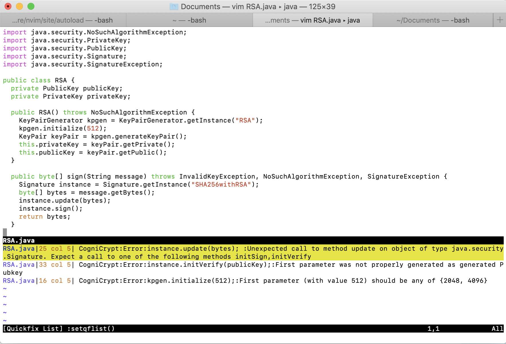

# How to run CogniCryptLSP in Vim?
1. Make sure you have installed [Vim](https://www.vim.org/download.php). Tested version for this tutorial is Vim 8.0.

2. Download `CogniCryptLSP-0.0.1.jar` and `config.zip` from https://github.com/MagpieBridge/CryptoLSPDemo/releases, unzip `config.zip`.

3. Make sure you have intalled `vim-plug` for Vim following the instructions from https://github.com/junegunn/vim-plug.

4. Edit Vim setting file `.vimrc` by adding the following lines. 
Change the paths `PATH_TO_JAVA_HOME/bin/java`,  `PATH_TO/crypto-lsp-demo-0.0.1-SNAPSHOT.jar`, `PATH_TO/config` to your local paths. 


```
call plug#begin('~/.vim/plugged')

Plug 'prabirshrestha/async.vim'
Plug 'prabirshrestha/vim-lsp'

call plug#end()


au User lsp_setup call lsp#register_server({
        \ 'name': 'CogniCryptLSP',
        \ 'cmd': {server_info->['PATH_TO_JAVA_HOME/bin/java', '-jar', 'PATH_TO/crypto-lsp-demo-0.0.1-SNAPSHOT.jar', '-c', 'PATH_TO/config']},
        \ 'whitelist': ['java'],
        \ })
	
let g:lsp_log_verbose = 1
let g:lsp_log_file = expand('~/vim-lsp.log') 
```

An example for `.vimrc` file can be downloaded from [here](https://github.com/MagpieBridge/CryptoLSPDemo/blob/master/doc/.vimrc)

4. Open a Java File with Vim will trigger CogniCryptLSP to run. You can use [RSA.java](https://github.com/MagpieBridge/CryptoLSPDemo/blob/master/doc/RSA.java) to test.

5. In Vim call ``:LspDocumentDiagnostics`` to display all the crypto errors. More LSP commands for Vim can be found here https://github.com/prabirshrestha/vim-lsp



5. To rerun CogniCryptLSP in a changed Java File, simply save the file.


Questions? Ask [Linghui Luo](https://github.com/linghuiluo)
