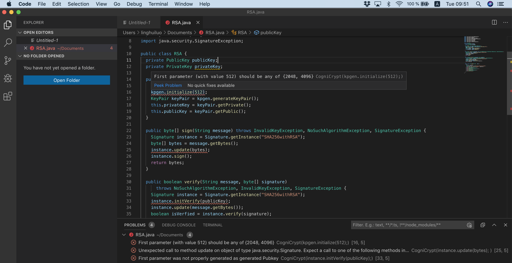

# How to run CogniCryptLSP in Visual Studio Code?
1. Make sure you have installed [VS Code](https://code.visualstudio.com/download). Tested version for this tutorial is VS Code 1.33.1.

2. Download the VS Code extension file `CogniCryptLSP-0.0.1.vsix` from https://github.com/MagpieBridge/CryptoLSPDemo/releases.

3. Select `Extensions >> Install from VSIX...` and choose `CogniCryptLSP-0.0.1.vsix` to [install the extension](https://code.visualstudio.com/docs/editor/extension-gallery#_install-from-a-vsix).

4. Restart VS Code.

5. Open a Java File in VS Code will trigger CogniCryptLSP to run. You can use [RSA.java](https://github.com/MagpieBridge/CryptoLSPDemo/blob/master/doc/RSA.java) to test.

6. Select `View >> Problems` to see the crypto errors.

7. To rerun CogniCryptLSP in a changed Java File, simply save the file.

Questions? Ask [Linghui Luo](https://github.com/linghuiluo)
